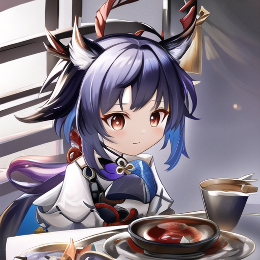

在一个神秘的世界中，宵宫、玛露希尔、东山小红、阿尔图罗、川井璃夏和维什戴尔等来自不同领域的勇士们相遇了。他们被命运之手引导，踏上了一场跨越欧陆风云4中的大明以及其他领域的奇幻冒险之旅。

故事开始于玛露希尔的森林深处，一座神秘的传送门出现了，将来自不同领域的勇士们聚集在了一起。他们发现自己被一股神秘力量所联系，共同面对着一场来自未知的威胁。

宵宫，来自玛露希尔的魔法师，拥有强大的元素魔法，能够操控火焰和冰霜；玛露希尔则是一位优雅的精灵战士，以敏捷和精准的攻击闻名；东山小红是一名天生的猎手，精通各种武器和陷阱；阿尔图罗则是一位来自欧陆风云4的神圣骑士，信奉正义与勇气；川井璃夏是一位拥有神秘力量的法师，能够召唤出闪电和风暴；而维什戴尔则是一名来自大明的武术大师，精通各种武技。

这群勇士们被命运所联结，他们的使命是寻找并摧毁一股黑暗势力，这股势力威胁着所有领域的和平与安宁。于是，他们踏上了穿越不同领域的旅程，经历了种种挑战与考验。

他们先是来到了大明，一片繁荣而神秘的土地。在这里，他们面对着来自黑暗势力的邪恶生物和黑暗法师的袭击，与大明的勇士们并肩作战，保卫这片土地的安全。

接着，他们来到了玛露希尔的森林，与被黑暗势力操控的巨型生物展开了激战。玛露希尔的精灵战士玛露希尔以其优雅的剑技领导着队伍，与黑暗势力的生物进行了殊死搏斗。

然后，他们来到了欧陆风云4的领域，面对着黑暗势力的魔法军团。阿尔图罗带领着他的骑士团与黑暗法师的军队展开了激烈的战斗，以保卫他们的家园。

在一系列的冒险和战斗中，这群勇士们结成了深厚的友谊，相互信任、相互支持。最终，他们联手击败了黑暗势力的首领，拯救了所有领域的和平与安宁。

在这段冒险的旅程中，宵宫、玛露希尔、东山小红、阿尔图罗、川井璃夏和维什戴尔等勇士们展现了无畏的勇气和坚韧不拔的意志，成为了各自领域的英雄，他们的传说将永远被铭记于世。

| 模块名称 | 模块负责 |
|------|------|
|      |      |

数据库   mengnankkkk

前端   Margit-Arachne

blog   mengnankkkk

安全   mengnankkk

用户管理模块   Margit-Arachne

编码crypot模块   Margit-Arachne

帖子post模块   yaoplayer

帖子管理模块   yaoplayer

内容支持模块   yaoplayer

github管理模块    mengnankkkk

创意模块   yaoplayer

